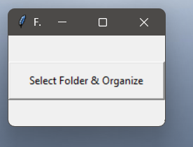

# 🧹 Smart File Organizer

### Python Desktop Automation Tool

Smart File Organizer is a lightweight **Python desktop application** that automatically organizes files into categories based on their file types.

Instead of manually sorting a messy folder, users can select a directory and let the application organize its contents with a single action.

---

## ✨ Features

* 📂 Automatically categorizes files
* 🖼️ Organizes images
* 🎬 Organizes videos
* 📄 Organizes documents
* 📦 Organizes other supported file types
* 🖱️ Simple graphical interface
* ⚡ One-click organization
* 🔁 Handles duplicate filenames
* 🪟 Windows executable available

---

## 📸 Application Preview

<p align="center">
  
</p>

---

## 🧠 How It Works

```text
              📁 Messy Folder
                    │
                    ▼
             🔍 Scan Files
                    │
                    ▼
          🧠 Detect File Type
                    │
        ┌───────────┼───────────┐
        ▼           ▼           ▼
     🖼️ Images   🎬 Videos   📄 Documents
        │           │           │
        └───────────┼───────────┘
                    ▼
             📂 Organized
               Folders
```

---

## 🛠️ Tech Stack

* **Python**
* **Tkinter** — Desktop GUI
* **os** — File and directory operations
* **shutil** — File movement and organization

---

## 🚀 Getting Started

### Option 1 — Run the Windows executable

Download:

```text
automation2_0.exe
```

Then:

1. Run the executable.
2. Select the folder you want to organize.
3. Start the organization process.
4. The application categorizes the files.

---

### Option 2 — Run from Python

Clone the repository:

```bash
git clone https://github.com/poovaragansiva-collab/smart-file-organizer.git
```

Enter the project:

```bash
cd smart-file-organizer
```

Run:

```bash
python automation2_0.py
```

---

## 📁 Project Structure

```text
smart-file-organizer/
│
├── assets/
│   └── smart-file-organizer.png
│
├── automation2_0.py
├── automation2_0.exe
└── README.md
```

---

## 🎯 Use Case

This project is designed for users who frequently deal with folders containing large numbers of mixed files.

Typical examples include:

* Downloads folders
* Desktop cleanup
* Project directories
* Media folders
* Document collections

The goal is to reduce repetitive manual file management through simple desktop automation.

---

## 🧩 What I Learned

Building this project helped me practice:

* Python file-system operations
* Desktop GUI development with Tkinter
* Working with directories and file extensions
* Automating repetitive tasks
* Handling duplicate filenames
* Packaging a Python application for Windows

---

## 🔮 Future Improvements

Possible improvements include:

* 📋 Custom category configuration
* 🔍 File preview
* ↩️ Undo organization
* 📊 Organization statistics
* ⚙️ User-defined file rules
* 🌓 Dark mode
* 📅 Automatic scheduled organization
* 📦 Improved cross-platform support

---

## 👨‍💻 Author

### Poovaragan S

**CSE Student • AI & Full-Stack Developer**

GitHub:
https://github.com/poovaragansiva-collab

LinkedIn:
https://www.linkedin.com/in/poovaragans

Portfolio:
https://poovaragan-portfolio.vercel.app/

---

<div align="center">

### 🧹 Less Mess. More Organization.

⭐ If you find this project useful, consider giving it a star.

</div>
